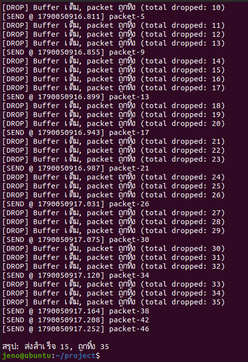

# Lab 14 — Traffic Shaping: Token Bucket & Leaky Bucket

จำลองการทำ Traffic Shaping บน Mininet เปรียบเทียบ **Token Bucket (Linux `tc tbf`)**
กับ **Leaky Bucket (เขียนเองด้วย Python)** แล้ววิเคราะห์ผลด้วย Wireshark

**กลุ่ม:** G19 · **Algorithm ที่ได้รับ:** `leaky_bucket`

## Parameter ของกลุ่ม

| Parameter | ค่า |
|---|---|
| bandwidth | 2 Mbps |
| token rate | 256 kbit |
| bucket size | 32 kbit |
| burst size | 97 packets |
| burst interval | 500 ms |
| packet size | 1400 bytes |
| latency | 400 ms |

แปลงเป็นหน่วยของ Leaky Bucket: drain rate ≈ **23 pps**, bucket capacity ≈ **3 packets**
(สูตรอยู่ใน comment ของ [`code/leaky_bucket_shaper.py`](code/leaky_bucket_shaper.py))

## โครงสร้างโปรเจค

```
code/
  topo_bucket.py              Topology h1 — s1 — h2 (จำกัด bandwidth 2 Mbps)
  generate_burst_traffic.py   ยิง burst traffic ด้วย Scapy
  leaky_bucket_shaper.py      Leaky Bucket ที่เขียนเอง (Part D)
  generate_group_params.py    สุ่ม parameter ตามรหัสกลุ่ม
results/
  v1_scapy_slow/              ผลรอบแรก (pcap before/after)
  v2_tbf/                     ผลหลังแก้ Scapy — shaping ด้วย tc tbf
  v2_leaky/                   ผลหลังแก้ Scapy — Leaky Bucket + ภาพผลรัน
docs/
  commands.md                 คำสั่งทั้งหมดที่ใช้ทำแล็บ ทีละขั้น
  report_skeleton.md          โครงรายงาน
  Parameter.docx              เอกสาร parameter
  group_params_G19.png        ผลรัน generate_group_params.py G19
```

## วิธีรัน

```bash
sudo apt install -y mininet python3-scapy tcpdump wireshark iproute2
cd code
sudo python3 topo_bucket.py                    # Part A
# ใน xterm ของ h1
tc qdisc add dev h1-eth0 root tbf rate 256kbit burst 32kbit latency 400ms   # Part B
python3 generate_burst_traffic.py              # Part C
python3 leaky_bucket_shaper.py                 # Part D
```

ขั้นตอนเต็ม (capture pcap, วิเคราะห์ IO Graph) ดูที่ [`docs/commands.md`](docs/commands.md)

## เวอร์ชัน

| เวอร์ชัน | สิ่งที่เปลี่ยน |
|---|---|
| V1 | โค้ดเริ่มต้น — แต่ Scapy ส่ง packet ช้ากว่าอัตราเติม token ทำให้ไม่เห็นผลการ shaping |
| V2 | แก้ `generate_burst_traffic.py` ให้เปิด socket ครั้งเดียวแล้วส่งทุก packet ผ่าน socket นั้น ส่งได้เร็วกว่าอัตรา token จึงเห็นผล shaping ชัด |

## ผลลัพธ์ (Leaky Bucket)



packet ถูกปล่อยออกห่างกันคงที่ ≈ 0.044 วินาที (ตาม drain rate 23 pps) ส่วนที่เกิน
buffer 3 packets ถูกทิ้ง — รอบนี้ส่งสำเร็จ 15 ทิ้ง 35

> ทดลองใน Mininet เท่านั้น ห้ามนำ burst traffic ไปยิงในเครือข่ายจริงโดยไม่ได้รับอนุญาต
